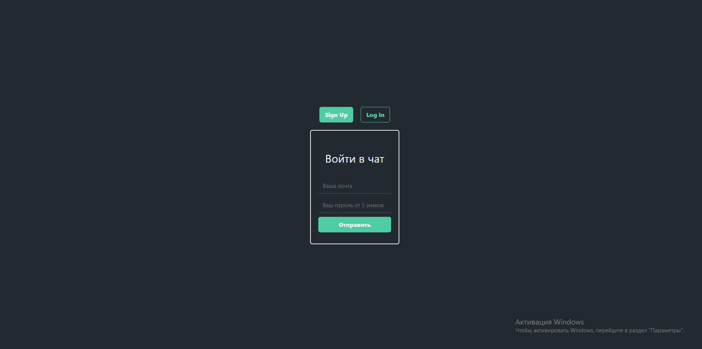
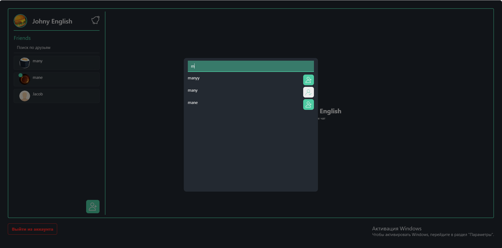
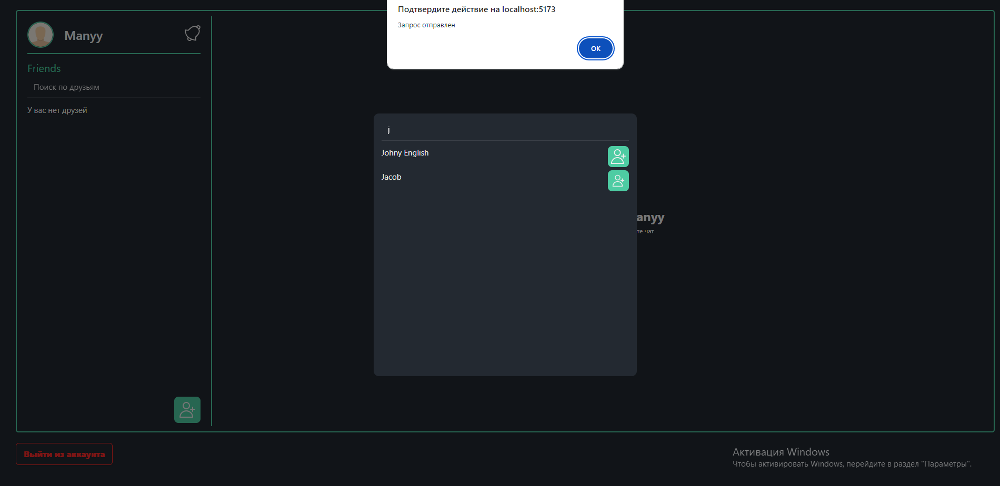
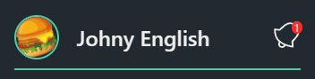
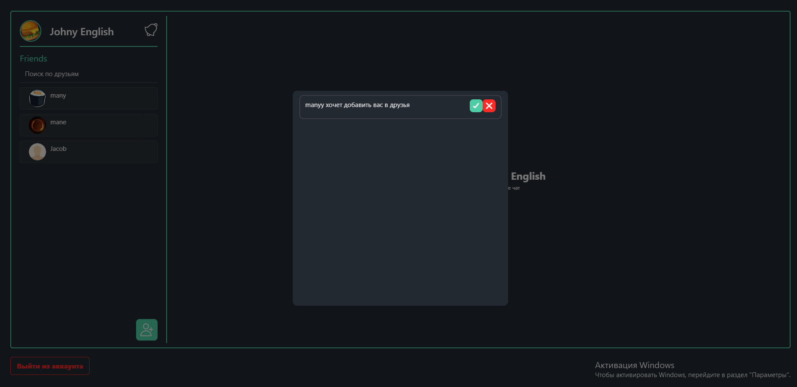
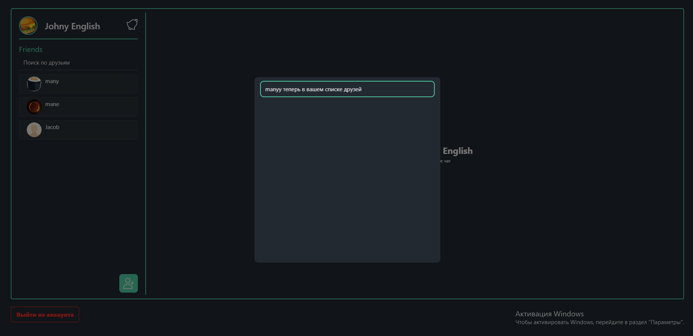
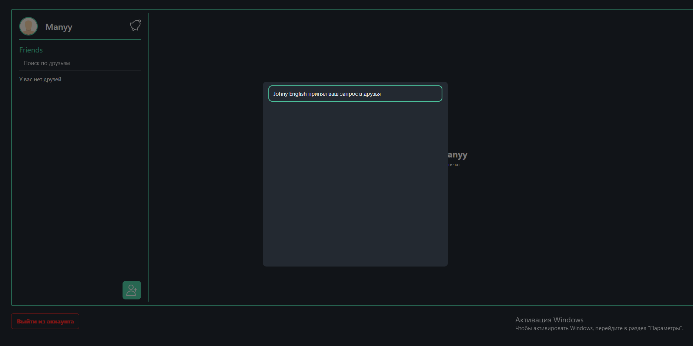
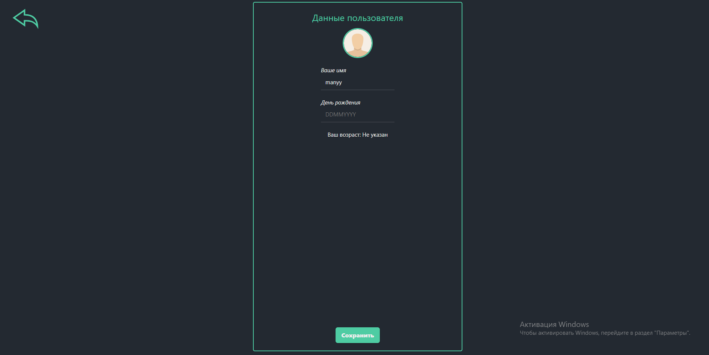
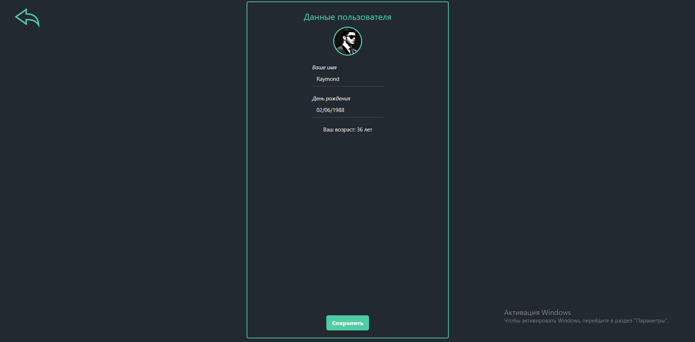

# Vue Single Chat App

Это пример простого чата на Vue.js и Node.js с использованием WebSocket.

## Установка

### Клиент (Client)

1. Перейдите в папку `client`.
2. Установите зависимости, выполнив команду:

    ```
    npm install
    ```

3. Запустите приложение в режиме разработки:

    ```
    npm run dev
    ```

### Сервер (Server)

1. Перейдите в папку `server`.
2. Установите зависимости, выполнив команду:

    ```
    npm install
    ```

3. Запустите сервер:

    ```
    npm run server
    ```

## Зависимости

### Клиент (Client)

- `@supabase/supabase-js`: ^2.39.8
- `socket.io-client`: ^4.7.4
- `vue`: ^3.4.15
- `vue-router`: ^4.2.5

### Сервер (Server)

- `dotenv`: ^16.4.5
- `express`: ^4.18.3
- `socket.io`: ^4.7.4


## Тестовые пользователи

Для тестирования функциональности чата вы можете использовать следующих тестовых пользователей:

### 1. Пользователь

- **Email:** ready@mai.ru
- **Пароль:** 123455

### 2. Пользователь

- **Email:** jacob@mail.ru
- **Пароль:** jacob12


### Скриншоты

1. Страница входа


2. Домашняя страница чатов


3. Поиск и добавление друзей 


4. Иконка уведомлений 


5. Окно уведомлений




P.S нужно обновить страницу для отображения изменений

6. Страница настроек




## Автор

Автор: GitM4n